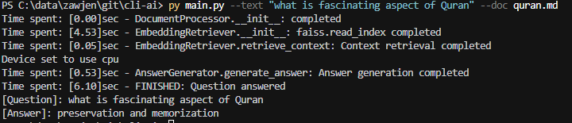

# Introduction

A CLI for Zawjen AI based Q&A. Retrieval-Augmented Generation (RAG) System.



## Setup

Install the following dependencies:

```sh
pip install sentence-transformers faiss-cpu numpy transformers argparse torch
```

1. `sentence-transformers`:  Generates embeddings for document chunks.  
2. `faiss-cpu`:  Efficient similarity search for retrieval.  
3. `numpy`:  Handles numerical operations.  
4. `transformers`:  Loads and runs the Flan-T5 model.  
5. `argparse`:  Parses command-line arguments (`--qid`).  
6. `torch`:  Required by transformers for deep learning model execution.  

## Run

Use following command to run application:

### Reference

```sh
python main.py [-h] [--text TEXT] [--doc DOC]
```

| Argument | Type | Required | Default Value                           | Description                                 |
| -------- | ---- | -------- | --------------------------------------- | ------------------------------------------- |
| --text   | str  | No       | None                                    | A simple text query                         |
| --doc    | str  | No       | None                                    | Document to be used to answer query         |
| --task   | str  | No       | question-answering                      | Type of pipeline task to use for processing |
| --model  | str  | No       | distilbert-base-uncased-distilled-squad | Model to use for the pipeline               |


### model

| Model Name                | Size            | Max Tokens | Purpose                                                  | Other Important Attributes                                                 |
| ------------------------- | --------------- | ---------- | -------------------------------------------------------- | -------------------------------------------------------------------------- |
| `distilbert-base-uncased` | 66M parameters  | 512        | Text classification, sentence embeddings                 | Fast, distilled version of BERT                                            |
| `bert-base-uncased`       | 110M parameters | 512        | Text classification, QA, embeddings                      | BERT, pre-trained transformer model for NLP tasks                          |
| `gpt2`                    | 117M parameters | 1024       | Text generation, language modeling                       | First GPT-based transformer, autoregressive                                |
| `gpt-neo-1.3B`            | 1.3B parameters | 2048       | Text generation, large-scale language model              | Open-source alternative to GPT-3                                           |
| `gpt-neo-2.7B`            | 2.7B parameters | 2048       | Text generation, language modeling                       | Open-source, larger GPT model                                              |
| `gpt-j-6B`                | 6B parameters   | 2048       | Text generation, language modeling                       | Open-source, optimized for creative tasks                                  |
| `mistral-7B`              | 7B parameters   | 8192       | Text generation, general-purpose AI                      | Fast, with longer context length                                           |
| `llama-2-7b`              | 7B parameters   | 4096       | Text generation, general-purpose AI                      | Meta's latest transformer, strong performance                              |
| `llama-2-13b`             | 13B parameters  | 4096       | Text generation, general-purpose AI                      | Stronger performance, larger scale                                         |
| `llama-2-70b`             | 70B parameters  | 4096       | Text generation, high-level reasoning                    | High-capacity, massive language model                                      |
| `t5-small`                | 60M parameters  | 512        | Text-to-text tasks (translation, summarization)          | Encoder-decoder architecture                                               |
| `t5-base`                 | 220M parameters | 512        | Text-to-text tasks (translation, summarization)          | Encoder-decoder architecture                                               |
| `flan-t5-base`            | 220M parameters | 512        | Text-to-text tasks, fine-tuned for instruction-following | Improved version of T5 for specific tasks                                  |
| `facebook/bart-large-cnn` | 406M parameters | 1024       | Summarization, text generation                           | Sequence-to-sequence model for summarization                               |
| `google/flan-t5-large`    | 770M parameters | 512        | Text-to-text tasks, fine-tuned for instruction-following | Larger version of T5 for better performance                                |
| `bloom-3b`                | 3B parameters   | 2048       | Text generation, language modeling                       | OpenAI’s GPT-like model with more parameters                               |
| `falcon-7b`               | 7B parameters   | 2048       | Text generation, language modeling                       | Efficient and fast, optimized for both generation and classification tasks |
| `command-r`               | 8B parameters   | 8192       | Instruction-following tasks                              | Fine-tuned for reasoning and tasks like code generation                    |
| `eleutherai/gpt-neo-2.7B` | 2.7B parameters | 2048       | Text generation, language modeling                       | Open-source GPT-like model for creative text                               |

### task

| Pipeline Task                | Description                                                  | Typical Use Cases                                      | Common Model Types                           |
|------------------------------|--------------------------------------------------------------|--------------------------------------------------------|---------------------------------------------|
| `text-classification`         | Classifies text into predefined categories                   | Sentiment analysis, spam detection, emotion recognition| BERT, RoBERTa, DistilBERT, XLM-R             |
| `question-answering`          | Answers questions based on a provided context                | QA systems, chatbot development, knowledge extraction  | BERT, DistilBERT, T5, ALBERT, DeBERTa         |
| `fill-mask`                   | Fills in missing words (masked tokens) in a sentence         | Cloze task, predictive text                           | BERT, RoBERTa, DistilBERT                    |
| `summarization`               | Generates a concise summary of a long document               | Document summarization, news summarization            | BART, T5, PEGASUS                           |
| `translation`                 | Translates text from one language to another                 | Language translation, multilingual communication      | MarianMT, T5, mBART                         |
| `text-generation`             | Generates human-like text based on a prompt                  | Text completion, story generation, code generation    | GPT-2, GPT-3, T5, GPT-Neo, Mistral           |
| `ner`                         | Identifies named entities (e.g., people, locations) in text  | Named entity recognition, extracting structured info  | BERT, RoBERTa, spaCy                        |
| `paraphrase`                  | Generates a paraphrase of the input text                     | Paraphrase detection, text simplification             | T5, BART, Pegasus                          |
| `zero-shot-classification`    | Classifies text into categories without pretraining the model| Text classification without labeled data               | BART, RoBERTa, XLM-R                       |
| `summarization`               | Summarizes long passages into shorter ones                   | Text summarization, headline generation               | BART, T5, PEGASUS                           |
| `sentiment-analysis`          | Analyzes sentiment of the input text (positive/negative)     | Sentiment classification, opinion mining              | BERT, DistilBERT, RoBERTa, XLNet            |
| `feature-extraction`          | Extracts features from text without classification or prediction | Feature extraction for downstream tasks              | BERT, RoBERTa, DistilBERT, ALBERT            |
| `text2text-generation`        | Generates a target sequence from a given input sequence      | Text translation, summarization, paraphrasing          | T5, BART, mBART                           |
| `translation_xx_to_yy`        | Translates text from one language to another specific pair   | Multilingual translation                               | MarianMT, mBART                           |
| `image-classification`        | Classifies images into predefined categories                | Image categorization, object detection                | Vision Transformer, ResNet, Swin Transformer |
| `object-detection`            | Detects objects in an image and returns their bounding boxes | Object detection, video analysis                      | DETR, YOLO, Faster R-CNN                    |
| `image-segmentation`          | Segments an image into parts and labels them                 | Image segmentation tasks, medical image processing    | Segformer, DeepLabV3, U-Net                |
| `speech-to-text`              | Converts spoken language into written text                   | Transcription, voice assistants                       | Wav2Vec2, Whisper                          |
| `text-to-speech`              | Converts text into spoken audio                             | Speech synthesis, voice assistants                    | Tacotron, Wave2Vec2, FastSpeech             |
| `automatic-speech-recognition`| Recognizes spoken language in audio                         | Audio transcription, language understanding from audio | Wav2Vec2, Whisper, DeepSpeech               |
| `image-captioning`            | Generates descriptive captions for images                    | Image caption generation, accessibility tools         | BLIP, Oscar, VinVL                         |
| `document-classification`     | Classifies documents into predefined categories             | Categorizing documents, content moderation            | BERT, RoBERTa, DistilBERT                   |
| `video-classification`        | Classifies video frames into categories                     | Video content analysis, video categorization          | TimeSformer, ViT, Swin Transformer          |

## Usage Example

Note, `quran.md` must be under folder `datasets` e.g. `./data/datasets/quran.md`
```sh
python main.py --text "how many juzz are in quran" --doc quran.md
```

Or

```sh
py main.py --text "how many juzz are in quran" --doc quran.md
```

## Model Choice

Model `free` alternatives depending on **hardware, accuracy needs, and speed requirements**. Since we have **16GB RAM and an Intel Core i7**, you can run **mid-sized models efficiently**, though GPU-based models may still be slow.  

`Flan-T5 (Large or XL)` is good for `Query Answer` use case as we have.

| **Model**                   | **Size**  | **Pros**                            | **Cons**                                | **Ideal For**                |
| --------------------------- | --------- | ----------------------------------- | --------------------------------------- | ---------------------------- |
| **Flan-T5 (Base/Large/XL)** | 250M - 3B | Lightweight, free, good for Q&A     | Less powerful than GPT-4                | General NLP, Query Answering |
| **Mistral-7B**              | 7B        | High accuracy, better than LLaMA-7B | Needs 8GB+ VRAM for good speed          | Chatbots, Reasoning          |
| **LLaMA 2-7B/13B**          | 7B / 13B  | Strong general performance          | Slower on CPU                           | Research, Chatbots           |
| **Falcon-7B/40B**           | 7B / 40B  | Open-source, good for text tasks    | Slow on CPU, 40B too large for 16GB RAM | Content Generation           |
| **Gemma-7B**                | 7B        | Optimized for instruction-following | Requires GPU for fast results           | AI Assistants                |
| **GPT-J-6B**                | 6B        | Reasonably fast, free               | Lower accuracy vs. newer models         | Creative Writing             |
| **GPT-NeoX-20B**            | 20B       | Powerful for reasoning              | Too large for 16GB RAM alone            | Advanced Research            |
| **Phi-2**                   | 2.7B      | Optimized, small, powerful          | Not as tested as Mistral                | Small-scale AI Apps          |

### Best Choice for QA, Intel i7 + 16GB RAM Setup

**Fastest (CPU-Friendly) Choice:**  
- **Flan-T5 (Large)** - Works well on CPU, good accuracy.  

**More Powerful But Heavier:**  
- **Mistral-7B** - Better than LLaMA-7B, but slower on CPU.  
- **LLaMA 2-7B** - Great, but needs more resources.  

**Best for Instruction-Following (Chatbots):**  
- **Gemma-7B** - Google's latest model.  
- **Phi-2** - Small but powerful.  

## Model for Embeddings

The model **`sentence-transformers/all-MiniLM-L6-v2`** is used for generating **embeddings** in project. If you want alternatives, you can choose based on **speed, accuracy, and size**.  

## Best Alternatives for `all-MiniLM-L6-v2`
| **Model**                              | **Size** | **Speed** | **Accuracy**                    | **Best For**          |
| -------------------------------------- | -------- | --------- | ------------------------------- | --------------------- |
| `all-MiniLM-L6-v2` *(Current Model)*   | 22M      | Fast      | Good                            | General-purpose       |
| **Smaller (Faster but Less Accurate)** |
| `all-MiniLM-L12-v2`                    | 33M      | Fast      | Slightly better accuracy        | Speed-focused apps    |
| `paraphrase-MiniLM-L6-v2`              | 22M      | Fast      | Optimized for similar sentences | Paraphrasing tasks    |
| `all-distilroberta-v1`                 | 82M      | Medium    | More accurate                   | General-purpose       |
| **Larger (More Accurate but Slower)**  |
| `multi-qa-mpnet-base-dot-v1`           | 110M     | Slower    | Higher accuracy                 | QA & retrieval        |
| `all-mpnet-base-v2`                    | 110M     | Slower    | More accurate than MiniLM       | Search engines        |
| `bge-large-en-v1.5`                    | 300M     | Slow      | Best accuracy                   | Search, QA            |
| `e5-large-v2`                          | 350M     | Slow      | Very high accuracy              | Large-scale retrieval |

### Best Choice for Your System (16GB RAM, Intel i7)
**If You Want Speed & Low Memory Usage**  
- **`all-MiniLM-L12-v2`** (Slightly better than current MiniLM model)  

**If You Want Higher Accuracy Without Too Much Slowdown**  
- **`all-mpnet-base-v2`** (More accurate than MiniLM, but slower)  

**If You Want the Best Accuracy & Can Handle More RAM Usage**  
- **`bge-large-en-v1.5`** or **`e5-large-v2`** (Best for retrieval tasks)  
